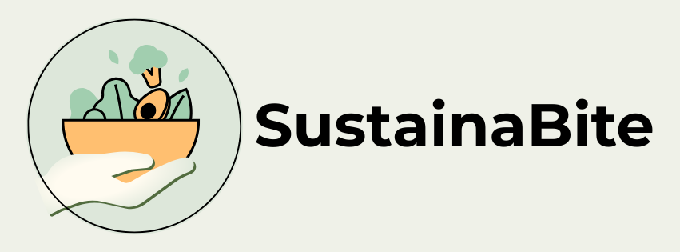
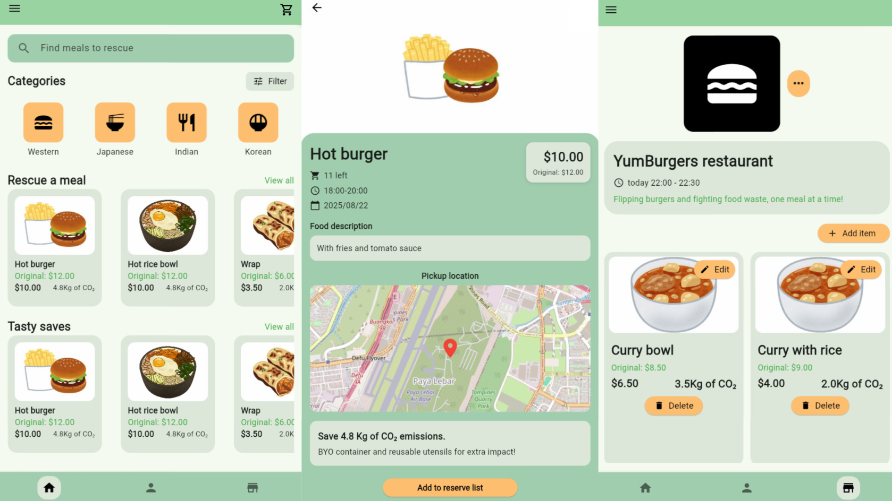

  

A sustainability-focused mobile application designed to reduce food waste by connecting food businesses with consumers seeking affordable meals.

---

# 🌱 Problem Identified

Food waste is a growing environmental and economic issue both globally and in Singapore, large amounts of edible food are discarded daily by food businesses.

This contributes heavily to:
- Greenhouse gas emissions
- Resource wastage (water, land, energy)
- Increasing landfill dependency

According to Singapore’s National Environment Agency (NEA):

- Food waste accounted for **11%** of Singapore’s total waste generated in 2023
- Approximately **755,000 tonnes** of food waste were generated
- Singapore’s only landfill, **Semakau Landfill**, is expected to be fully utilised by 2035

Globally:
- Nearly **19%** of food available to consumers is wasted annually
- Retail and food service sectors contribute millions of tonnes of avoidable food waste

SustainaBite was developed to address this issue by transforming surplus food into affordable, sustainable opportunities for consumers.

---

# 💡 Solution Overview

SustainaBite is a Flutter-based mobile application that connects food businesses with consumers willing to purchase quality surplus food at discounted prices.

The platform enables businesses to:
- Reduce unnecessary food disposal
- Recover operational costs
- Increase visibility of surplus meals

Consumers benefit by:
- Purchasing affordable meals
- Supporting sustainability efforts
- Reducing environmental impact through food rescue

By redistributing edible surplus food instead of discarding it, the application helps:
- Reduce food wastage
- Lower carbon emissions
- Promote sustainable consumption habits
- Extend the lifespan of Singapore’s landfill

---

# ✨ Core Features

## 🥗 Browse Surplus Meals
- View available food items in real-time
- Display food images, prices, availability, and sustainability impact

## 🔍 Advanced Search & Filtering
Implemented Firestore queries including:
- Prefix search by food name
- Filter by category
- Filter by maximum discounted price
- Multi-category filtering
- Price sorting
- Aggregation queries

## 💳 Integrated NETS QR Payment
- Real-time NETS QR payment system
- Payment confirmation flow with success/failure states

## 🏪 CRUD Operations for Businesses
Food businesses can:
- Add food listings
- Edit listings
- Delete listings
- Update prices and quantities

## 🎨 Personalisation
Users can customise the application theme using multiple colour themes.

## 🌍 Sustainability Awareness
- Display estimated CO₂ savings for rescued meals
- Encourage environmentally responsible purchasing decisions

---

# 🛠 Tech Stack

---

# 📱 Flutter Plugins & Technologies Used

### Firebase & Database
- Cloud Firestore
- Firebase Authentication

### Flutter Plugins
- `table_calendar`
- `flutter_map`
- `latlong2`
- `geolocator`
- `image_picker`
- `flutter_local_notifications`
- `flutter_tts`

---

# 🖼 Application Preview

  

---

# 📈 Sustainability Impact

SustainaBite aims to:
- Reduce avoidable food waste
- Promote sustainable consumption
- Support local food businesses
- Encourage environmentally responsible behaviour

Every rescued meal contributes toward:
- Lower greenhouse gas emissions
- Reduced landfill dependency
- Conservation of water and energy resources